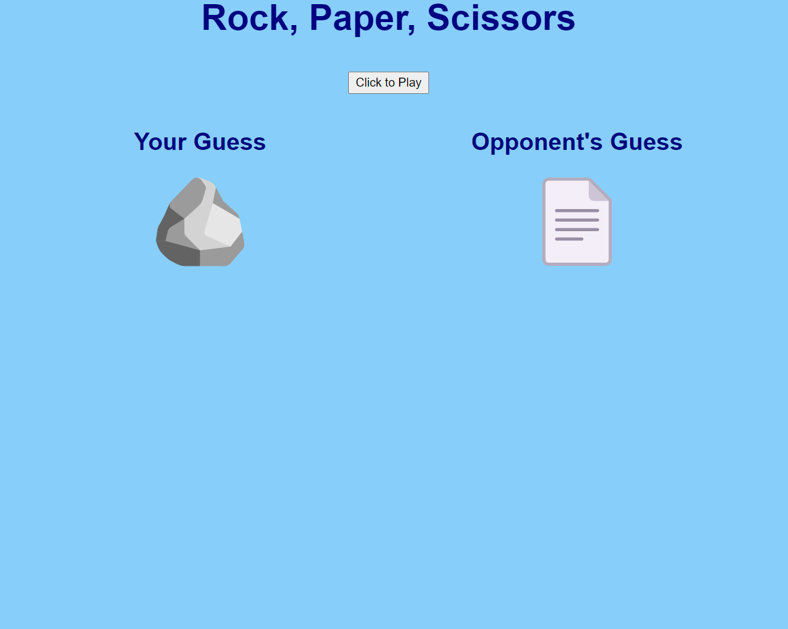

# rps-mini-project

## Description

This is a project for UW bootcamp in which a game of rock, paper, scissors is simulated against an opponent.

## Installation

N/A

## Usage

User must type in "R", "P", or "S" (can be upper or lower-case) in order to guess rock, paper or scissors. A random rock, paper or scissors guess will be generated for the opponent and the results compared and tracked. Upon quitting the game, the total wins, losses and ties will be displayed, along with the number of guesses of each type the user made.

Link to deployed application: https://ktunebe.github.io/rps-mini-project/

## Credits

Emojis for rock, paper and scissors were pasted from https://emojipedia.org/.

## License

N/A